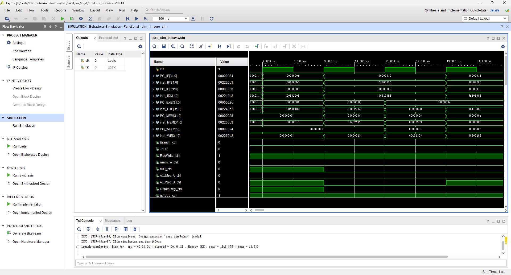
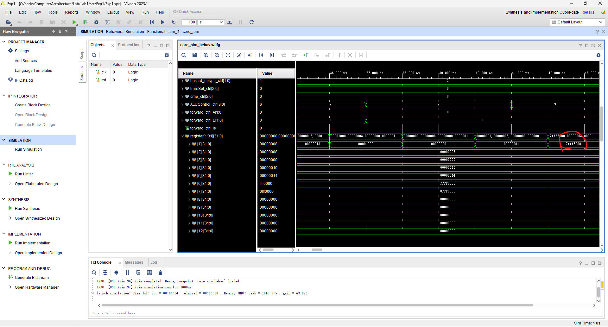
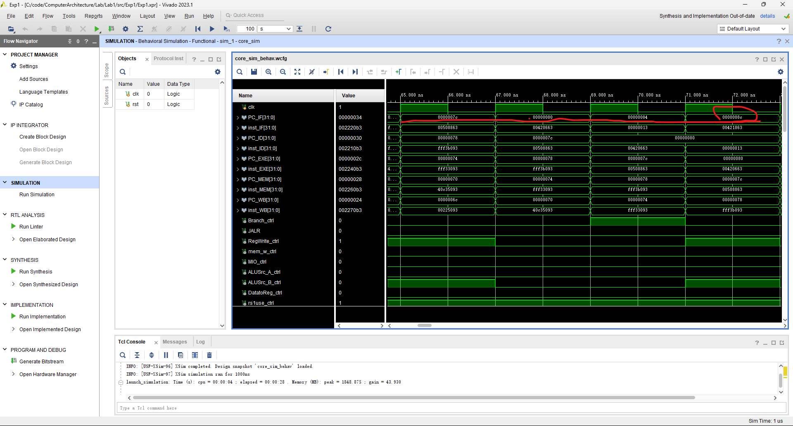

# Computer Architecture Lab1 report

## 3210104169 郑乔尹

---
## I. Experiment Purpose

1. Understand RISC-V RV32I instructions 
2. Master the design methods of pipelined CPU executing RV32I instructions
3. Master the method of Pipeline Forwarding Detection and bypass unit design
4. Master the methods of 1-cycle stall of Predict-not-taken branch design
5. Master methods of program verification of Pipelined CPU executing RV32I instructions

---
## II. Experiment Task 

+ Design of Pipelined CPU executing RV32I instructions
	1. Design datapath 
	2. Design Bypass Unit 
	3. Design CPU Controller 
	4. Verify the Pipelined CPU with program and observe the execution of program 

---
## III. Basic Principle
### Hazard Types
1. Structure Hazard
2. Data Hazard
3. Control Hazard
+ But for forward(bypass), we can re-classify them to these 3 types:
1. Operation without Memory read or Write, but use ALU calculation
2. Load from Memory
3. Store to Memory
> in detail 
1. `R type`, `I type`, `JAL`, `JALR`, `LUI`, `AUPIC`
2. `L type`
3. `S type`

### Hazard Solution

1. 无法规避的Stall
+ 必须要stall的情况比较少，仅在前一指令为`Load`指令时才会发生。(`store`虽然也访存，但是寄存器的值是已经存在的)
+ 假设Load指令正在从内存中向寄存器`r_n`读取数据（**WB**），而下一指令又要取用`r_n`（**ID**），即`Load`跟着`R type`, `I type`, `JAL`, `JALR`, `AUPIC`, `LUI`, `B type`这些需要在ID阶段读取**同一寄存器值**的指令时，无法避免的需要一个`stall`，因此可以通过检测前一指令是否为`L type`来规避可能发生的`data hazard`, 进而能将前一指令`MEM`阶段读取到的寄存器值`forward`到当前指令的`EX`阶段
2. 直接Forward
+ 这种情况也需要分为两类
	1. 前一条为`L type`下一条为`S type`，此种情况在两个指令的`MEM`阶段进行`forward`
	2. 非`L type`与`S type` 指令相连的情况，寄存器占用导致的forward，寄存器值可以从上上个MEM阶段到当前EX阶段，也可以从上一个EX阶段到当前EX阶段
3. Control Hazard
	1. 对于跳转指令，采取Predict Not Taken策略，即对于即将发生的跳转指令，默认其不执行跳转，先继续执行，如果发现判断出的信号正确，则进行flush，将正在进行的取指全部清空。
	> 因为branch指令在ID阶段就能得知当前信号是否正确，而下一条指令此时刚刚取指，可以通过flush将错误执行的指令停止

### Predict-not-taken
+ 假设不跳转，先继续为下一条指令取指，等待当前指令到达译码阶段后可以得知比较结果是否正确，假如错误，则继续执行，否则将已经取指的下一条指令进行flush，防止其被译码并错误执行，然后执行跳转指令，跳转至正确位置。

### Forward Types
1. `01`: $EXE_{ALU}\rightarrow next\ EXE$
2. `10`: $MEM_{ALU}\rightarrow next\ 2\ EXE$
3. `11`: $MEM_{read}\rightarrow next\ MEM_{write}$
4. `00`: no forward, use register

---
## IV. Operating Procedures

1. **CtrlUnit**
+ Operation type detection:
```Verilog
	wire BEQ = Bop & funct3_0;                            //to fill sth. in
    wire BNE = Bop & funct3_1;                            //to fill sth. in
    wire BLT = Bop & funct3_4;                            //to fill sth. in
    wire BGE = Bop & funct3_5;                            //to fill sth. in
    wire BLTU = Bop & funct3_6;                           //to fill sth. in
    wire BGEU = Bop & funct3_7;                           //to fill sth. in
    
    wire LB = Lop & funct3_0;                            //to fill sth. in
    wire LH = Lop & funct3_1;                            //to fill sth. in
    wire LW = Lop & funct3_2;                            //to fill sth. in
    wire LBU = Lop & funct3_4;                            //to fill sth. in
    wire LHU = Lop & funct3_5;                            //to fill sth. in

    wire SB = Sop & funct3_0;                             //to fill sth. in
    wire SH = Sop & funct3_1;                             //to fill sth. in
    wire SW = Sop & funct3_2;                             //to fill sth. in

    wire LUI   = LUIop;                          //to fill sth. in
    wire AUIPC = AUPICop;                          //to fill sth. in

    wire JAL  = JALop;                           //to fill sth. in
    assign JALR = JALRop & funct3_0;
```
+ detection for JAL, JALR, AUPIC and LUI
``` Verilog
    wire JAL  = JALop;                           //to fill sth. in
    assign JALR = JALRop & funct3_0;
    wire LUI   = LUIop;                          //to fill sth. in
    wire AUIPC = AUPICop;
```
+ branch signal
> the operation which need jump and compare
``` Verilog
assign Branch = (B_valid & cmp_res) | JAL | JALR;
```
+ ALU source detection
```Verilog
assign ALUSrc_A = JAL | JALR | AUIPC; 
assign ALUSrc_B = I_valid | L_valid | S_valid | LUI | AUIPC; 
```
+ register used detection signal
```Verilog
assign rs1use = JALR | R_valid | I_valid | S_valid | B_valid | L_valid;                 assign rs2use = S_valid | R_valid | B_valid;
```
+ Hazard detection input signal
``` Verilog
assign hazard_optype =
        {2{R_valid | I_valid | JAL | JALR | LUI | AUIPC} & 2'b01} |
        {2{L_valid} & 2'b10} |
        {2{S_valid} & 2'b11} |
        2'b00;
```

2. **HazardDetectionUnit**
> 我对Hazard Optype的定义如下：`00`代表没有Hazard，`01`代表ALU计算指令可能产生的Hazard，`10`代表`L type`可能产生的Hazard，`11`代表Store指令可能产生的Hazard，实际上只是检测了当前指令的种类，将其分为3类处理以便后续hazard检测。
+ stall 
``` Verilog
wire stall = (hazard_optype_ID != 2'b11) & //ID hazard not store
        (hazard_optype_EX == 2'b10) & //EXE hazard load
        (((rd_EXE == rs1_ID) & rs1use_ID) | ((rd_EXE == rs2_ID) & rs2use_ID)); 
        //EXE write to the same reg
```
+ Mem to EX forward
> 确认当前MEM阶段的指令为ALU计算(即上上条指令为涉及ALU计算的指令)，当前指令与之存在data hazard.
```Verilog
wire rs1_forward_MD = (hazard_optype_MEM == 2'b01) && //MEM hazard data
        ((rd_MEM == rs1_ID) && rd_MEM) && //MEM write to rs1
        (rs1use_ID); //ID read from rs1

wire rs2_forward_MD = (hazard_optype_MEM == 2'b01) && //MEM hazard data
        ((rd_MEM == rs2_ID) && rd_MEM) && //MEM write to rs2
        (rs2use_ID); //ID read from rs2
```
+ EX to EX forward
> 确认当前EX阶段的指令为ALU计算(即上条指令为涉及ALU计算的指令)，当前指令与之存在data hazard.
```Verilog
wire rs1_forward_ED = (hazard_optype_EX == 2'b01) && //EXE hazard data
        ((rd_EXE == rs1_ID) && rd_EXE) && //EXE write to rs1
        (rs1use_ID); //ID read from rs1
wire rs2_forward_ED = (hazard_optype_EX == 2'b01) && //EXE hazard data
		((rd_EXE == rs2_ID) && rd_EXE) && //EXE write to rs2
		(rs2use_ID); //ID read from rs2
```
+ LS forward
> L type到S type的forward
``` Verilog
wire rs1_forward_LS = (hazard_optype_MEM == 2'b10) & //MEM hazard load
        (rd_MEM == rs1_ID & rd_MEM) & //MEM write to rs1
        (rs1use_ID); //ID read from rs1

wire rs2_forward_LS = (hazard_optype_MEM == 2'b10) & //MEM hazard load
        (rd_MEM == rs2_ID & rd_MEM) & //MEM write to rs2
        (rs2use_ID); //ID read from rs2
```
+ forward signal
> 这里需要与RV32core模块连线相对应，我的forward信号定义如下：00正常使用寄存器值，01使用EX阶段forward的ALU计算值，10使用MEM阶段forward的ALU计算值，11使用MEM阶段forward寄存器读取值(对应前一条为L Type的情况)
+ 注意不同种类forward的***优先级***，一开始因为优先级写错了(直接用了`&`)，导致RRR的情况没法正确forward。**即EX阶段的forward应该优先于MEM阶段的forward**。
```Verilog
assign forward_ctrl_A = rs1_forward_ED ? 2'b01 :
						(rs1_forward_MD ? 2'b10 :
						(rs1_forward_LD ? 2'b11 : 2'b00));
assign forward_ctrl_B = rs2_forward_ED ? 2'b01 :
						(rs2_forward_MD ? 2'b10 :
						(rs2_forward_LD ? 2'b11 : 2'b00));
assign forward_ctrl_ls = (rs2_EXE == rd_MEM) && rd_MEM && (hazard_optype_EX == 2'b11) && (hazard_optype_MEM == 2'b10);
```
> 以下是对应的多路选择器信号连接：
```Verilog
MUX4T1_32 mux_forward_A(.I0(rs1_data_reg),.I1(ALUout_EXE),.I2(ALUout_MEM),.I3(Datain_MEM),        //to fill sth. in ()
        .s(forward_ctrl_A),.o(rs1_data_ID));

MUX4T1_32 mux_forward_B(.I0(rs2_data_reg),.I1(ALUout_EXE),.I2(ALUout_MEM),.I3(Datain_MEM),        //to fill sth. in ()
        .s(forward_ctrl_B),.o(rs2_data_ID));

MUX2T1_32 mux_forward_EXE(.I0(rs2_data_EXE),.I1(Datain_MEM),.s(forward_ctrl_ls),.o(Dataout_EXE));        //to fill sth. in ()
```

3. **cmp_32**
+ 此模块用于Branch的ID阶段的判断，传入比较种类和两个寄存器的值，如果比较结果正确，返回1，否则返回0.

``` Verilog
assign c = (EQ & res_EQ) |
        (NE & res_NE) |
        (LT & res_LT) |
        (LTU & res_LTU) |
        (GE & res_GE) |
        (GEU & res_GEU); //to fill sth. in ()
```

---
## V. Checkpoint Analysis
1. 前一条为`L type`, 下一条不为`S type`, 需要stall:(上一条为`lw x4, 8(x0)`下一条为`add x1, x2, x4`, x4寄存器值需要获取lw读取值)
> 可以看到，PC=0x10时正确stall，此时`add x1, x2, x4`正在译码阶段

2. 3条指令同时出现对同一寄存器的使用，比如以下情况：
+ 此时第三条指令需要使用寄存器x1的值，但是其值需要等待EX阶段，我们需要正确的将EX阶段指令的那个ALU计算值进行forward，使得`srl x1,x6,x1`能够在EX阶段获取到正确x1(rs2)值
```
```asm
slt x1,x4,x2 (MEM)
slt x1,x2,x4 (EX)
srl x1,x6,x1 (ID) 
```
> 可以看到，位移指令执行了正确的结果：

3. 跳转指令
+ 跳转条件错误，不跳转
``` asm
				sltiu x1, x6, -1 
0x78 0xFFF3B093 sltiu x1, x7, -1 
0x7c 0x00508863 beq x1,x5,label0 (RRB) 
0x80 0x00420663 beq x4,x4,label0 
0x84 0x00000013 addi x0,x0,0
0x88 0x00000013 addi x0,x0,0 
0x8c 0x00421863 label0: bne x4,x4,label1
```
> 以下是执行结果，观察PC可知，`beq x1,x5,label0`未跳转

+ 跳转条件正确，跳转至label0
> 以下是执行结果
